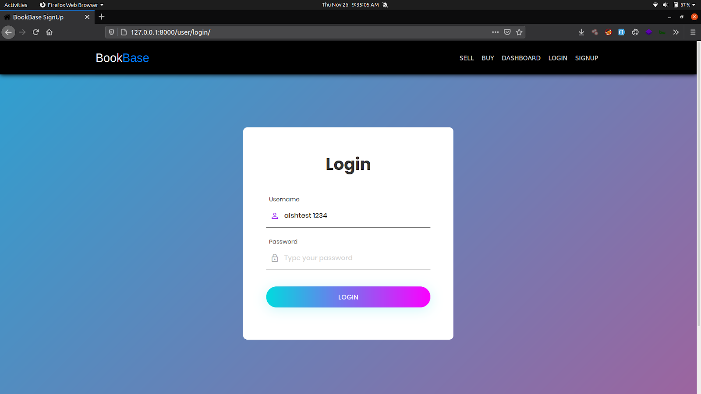
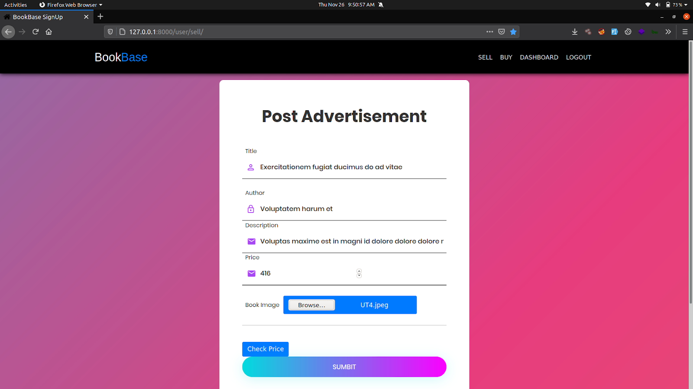
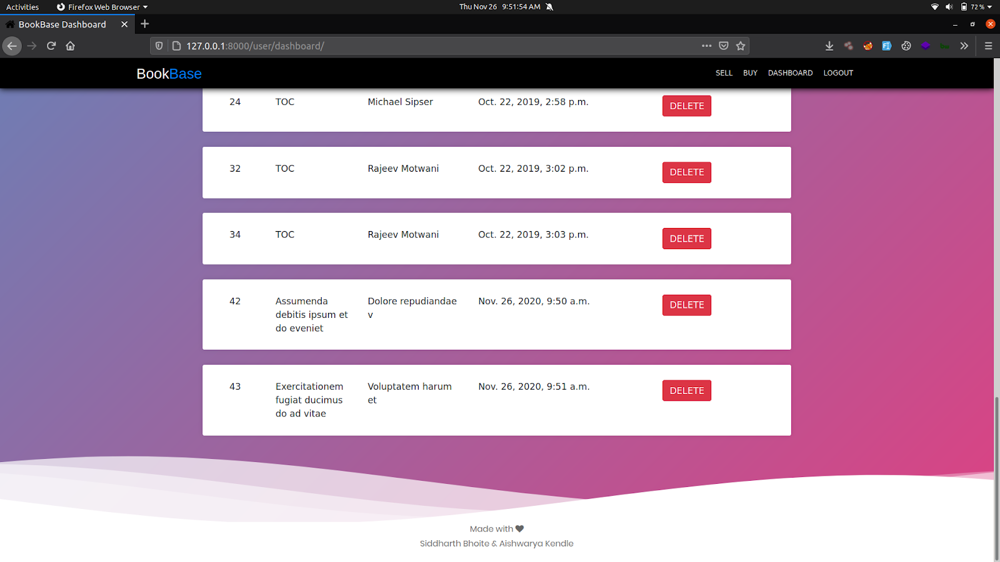
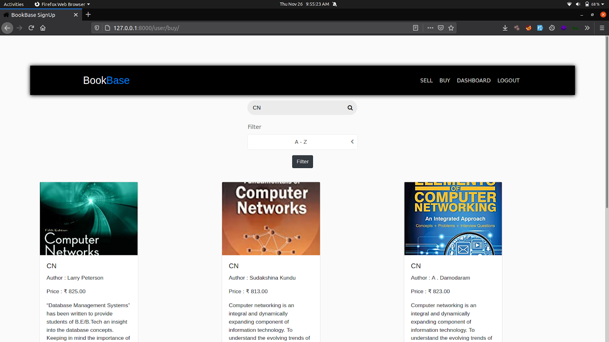
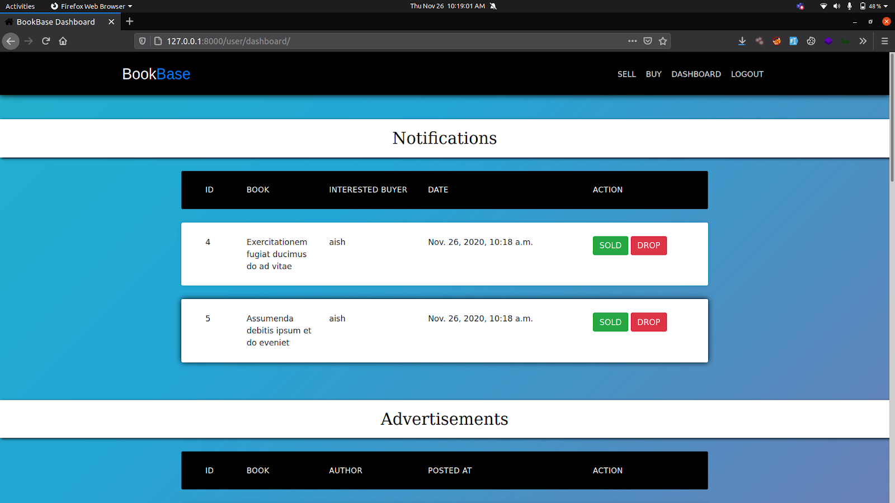

<h1 align="center">
   
  
</h1>

<h4 align="center">Portral to the world of books exchange for a wide range.</h4>

<h2 align="center"><a href = "https://boook-base.herokuapp.com/user/login/">Click here to view the deployed version</a></h4>

	
  <a href="https://rubyonrails.org/">
    
    <a href="https://github.com/SocioDroid/BookBank/commits/master">
        
    
	    
	    

## About 💡

<table>
<tr>
<td>
The project, “BOOKBANK” is a Django-based application consisting of an elegant UI for users to register and login and facilitate themselves with the book buy and sell functionality. The application is e-commerce website to trade used books based on current trends.
</td>
</tr>
</table>

    
## Features ⚡️
 - Built with Django
 - SMS integration [TEXTLOCAL]
 - Trend Analysis for Price
 - Uses Jinja template engine

## Installation ⚙️
	  
##### Deploy on heroku:
	  

	  
### OR
	  
##### Deploy on local machine:
* **[Download](https://github.com/SocioDroid/BookBank/archive/main.zip)** the latest version of the repo or clone it using 

		git clone https://github.com/SocioDroid/leetcode-py-cli.git
    
* Install dependencies 
          
        pip install -r requirements.txt 
    
* Make migrations
        
        python3 manage.py makemigrations

* Migrate the migrations
        
        python3 manage.py migrate    

* Start the server
        
        python3 manage.py runserver    

## Gallery ⚡️
    
<h1 align="left">
  </a>
   
</h1>

<h1 align="left">
  </a>
   
</h1>

<h1 align="left">
  </a>
   
</h1>

<h1 align="left">
  </a>
   
</h1>

<h1 align="left">
  </a>
   
</h1>

## Author 👤

|  	|
|:---------------------------------------------------------------------------------------------------------:	|
|                                            **Aishwarya Kendle**                                            	|
